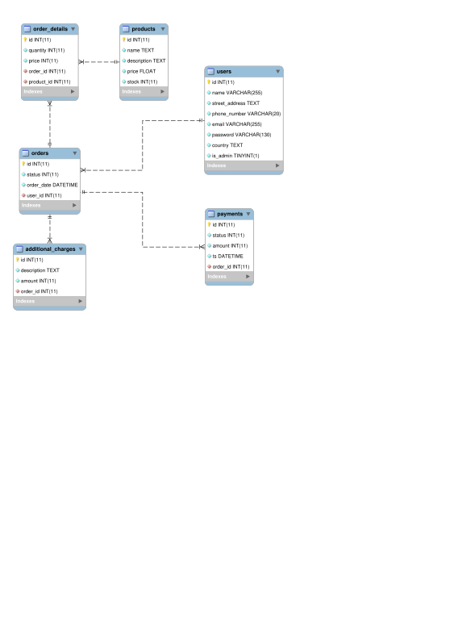
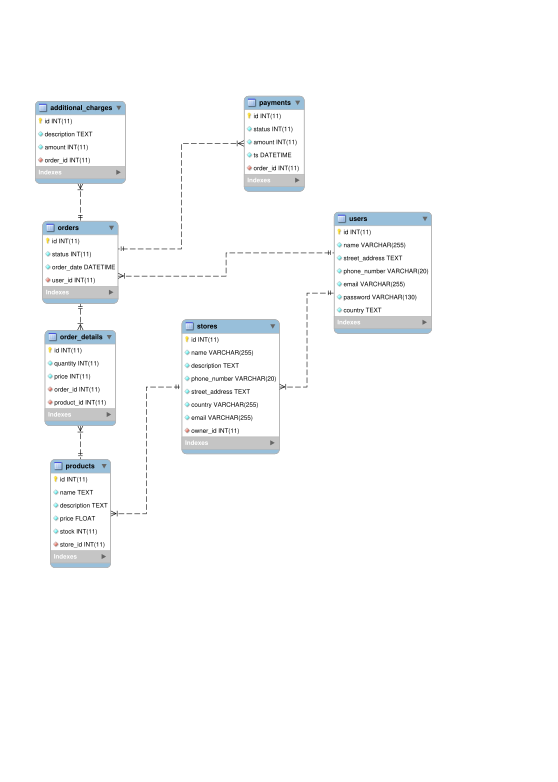

# Tugas 1

Buatlah model database untuk e-shopping dan e-commerce (beserta isinya minimal
100 records).

## Skema Database

Didesain dengan menggunakan tool MySQL Workbench. Ada di direktori `eer-diagrams`.

## Proses Hydration

Dilakukan dengan menggunakan bantuan tool Mockaroo. File-file SQL ada di
direktori `sql`.
